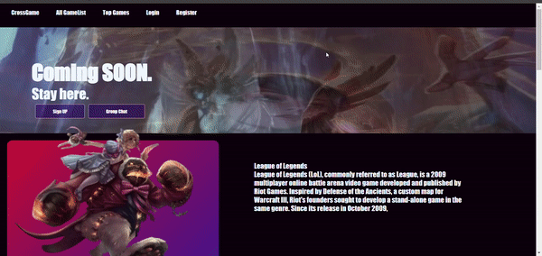

# CrossGame
Simple platform offers an immersive experience for purchasing character based video games and accessing intricate character details. With its unique design using Angular Applying Services , Routing, and RxJS

## Content :

<a href="#feature">Features </a>
<a href="#usage">Usage </a>
<a href="#screens">Screens </a>

## Features 

- Responsive Design using HTML and CSS
- Applying fast performance using RxJS

## Follow these steps to run the project on your local machine:

1 - Download the Zip File / Clone the repo :

    Navigate to Project Directory
    
2 - Open a terminal or command prompt

    Use the cd command to navigate to the directory where you extracted the zip file:(cd path/to/extracted/folder)
    
3 - Install Dependencies:

    Make sure you have Node.js and npm (Node Package Manager) installed on your machine.
    
    Run the following command to install project dependencies: (npm i / npm install)
    
4- Start Running: 

    Run the following command to start the development server:
    
    (ng serve -o)

## screens

  

